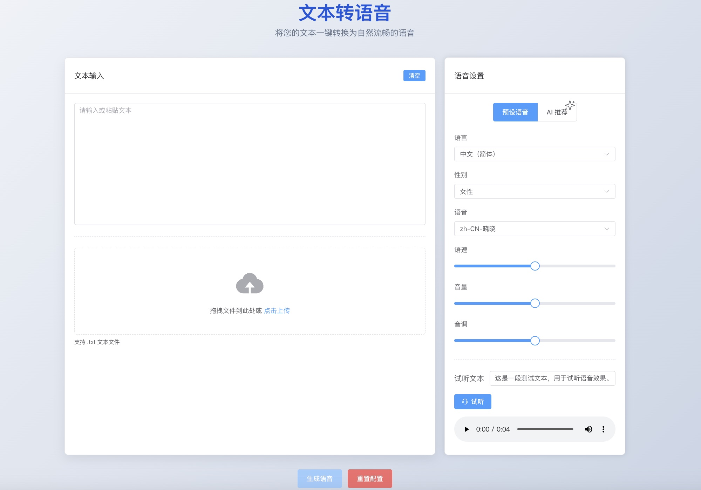

# EasyVoice 🎙️

## 在线体验

[easyvoice.denode.fun](https://easyvoice.denode.fun)

## 项目简介 ✨  


**EasyVoice** 是一个开源的智能文本/小说转语音解决方案，旨在帮助用户轻松将文本内容转换为高质量的语音输出。  

- **一键生成语音和字幕**

- **AI 智能推荐配音**

- **完全免费，无时长、无字数限制**

- **支持将 10 万字以上的小说一键转为有声书！**

无论你是想听小说、为创作配音，还是打造个性化音频，EasyVoice 都是你的最佳助手！

**你可以轻松的将 EasyVoice 部署到你的云服务器或者本地！**

## 核心功能 🌟



- **文本转语音** 📝 ➡️ 🎵  
  一键将大段文本转为语音，高效又省时。
- **多语言支持** 🌍  
  支持中文、英文等多种语言。  
- **字幕支持** 🌍  
  自动生成字幕文件，方便视频制作和字幕翻译。  
- **角色配音** 🎭  
  提供多种声音选项，完美适配不同角色。  
- **自定义设置** ⚙️  
  可调整语速、音调等参数，打造专属语音风格。  
- **AI 推荐** 🧠  
  通过 AI 智能推荐最适合的语音配置，省心又贴心。  
- **试听功能** 🎧  
  生成前可试听效果，确保每一句都如你所愿！  

## 技术实现 🛠️

EasyVoice 采用现代化的技术栈打造，稳定又高效：

- **前端**：Vue 3 + TypeScript + Element Plus 🌐  
- **后端**：Node.js + Express + TypeScript ⚡  
- **语音合成**：Microsoft Azure TTS + OpenAI(OpenAI 兼容即可) + ffmpeg 🎤  
- **部署**：Node.js + Docker + Docker Compose 🐳  

## 快速开始 🚀

### 1. 通过 docker 运行

带 AI 配音推荐：

```bash
docker run -d \
  --restart unless-stopped \
  --name easyvoice \
  -p 3000:3000 \
  -v $(pwd)/audio:/app/audio \
  -e OPENAI_BASE_URL=https://api.openai.com/v1 \
  -e OPENAI_KEY=your_openai_key_here \
  -e MODEL_NAME=gpt-4o-mini \
  cosincox/easyvoice:latest
```

不使用 AI 配音推荐：

```bash
docker run -d \
  --restart unless-stopped \
  --name easyvoice \
  -p 3000:3000 \
  -v $(pwd)/audio:/app/audio \
  cosincox/easyvoice:latest

```

### 2. 本地运行项目（请先确保已安装 Node.js 环境，参考：[安装 Node.js](https://zhuanlan.zhihu.com/p/442215189)）

```bash
# 开启/安装 pnpm
corepack enable
# 或者使用 npm 安装 pnpm
npm install -g pnpm

# 克隆仓库
git clone git@github.com:cosin2077/easyVoice.git
cd easyVoice
# 安装依赖
pnpm i -r

# 开发模式
pnpm dev:root

# 生产模式
pnpm build:root
pnpm start:root
```

## 快速开发 🚀

1. 克隆仓库

```bash
git clone https://github.com/cosin2077/easyVoice.git
```

2. 安装依赖

```bash
pnpm i -r
```

3. 启动项目

```bash
pnpm dev
```

4. 打开浏览器，访问 `http://localhost:5173/`，开始体验吧！

## 环境变量 ⚙️

| 变量名              | 默认值                         | 描述                          |
|--------------------|-------------------------------|------------------------------|
| `PORT`             | `3000`                        | 服务端口                      |
| `OPENAI_BASE_URL`  | `https://api.openai.com/v1`   | OpenAI 兼容 API 地址          |
| `OPENAI_API_KEY`   | -                             | OpenAI API Key               |
| `MODEL_NAME`       | -                             | 使用的模型名称                 |
| `RATE_LIMIT_WINDOW`| `1`                           | 速率限制窗口大小（分钟）         |
| `RATE_LIMIT`       | `10`                          | 速率限制次数                   |
| `EDGE_API_LIMIT`   | `3`                           | Edge-TTS API 并发数           |

- **配置文件**：可在 `.env` 或 `packages/backend/.env` 中设置，优先级为 `packages/backend/.env > .env`。  
- **Docker 配置**：通过 `-e` 参数传入环境变量，如上文示例。

## FAQ

- **Q: 如何配置 OpenAI 相关信息?**
- A: 在 `.env` 文件中添加 `OPENAI_API_KEY=your_api_key` `OPENAI_BASE_URL=openai_compatible_base_url` `MODEL_NAME=openai_model_name`，你可以用任何 openai compatible 的 API 地址和模型名称，例如 `https://openrouter.ai/api/v1/` 和 `deepseek`。

- **Q: 为什么我的AI配音效果不好？**
- A: AI 推荐配音是通过大模型来决定不同的段落的配音参数，大模型的能力直接影响配音结果，你可以尝试更换不同的大模型，或者是用 Edge-TTS 选择固定的声音配音。

- **Q: 速度太慢？**
- A: AI 推荐配音需要把输入的文本分段、然后让 AI 分析、推荐每一分段的配音参数，最后再生成音频、拼接。速度会比直接用 Edge-TTS慢。你可以更换相应更快的大模型，或者尝试调节`.env`文件的 Edge-TTS 的并发参数：EDGE_API_LIMIT为更大的值(10 以下)，注意并发太高可能会有限制。

## Tips

- 当前主要通过 Edge-TTS API 提供免费语音合成。  

- 未来计划支持官方 API、Google TTS、声音克隆等功能。
